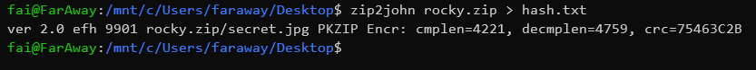
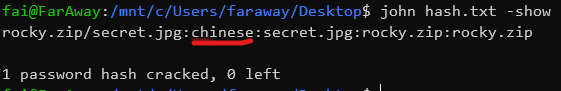
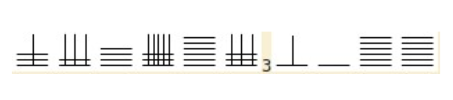

## John and rock (70 pts)

Disini kita mendapatkan sebuah file `rocky.zip` yang telah dilock dengan sebuah password

Dilihat dari title challenge ini kita "disuruh" untuk menggunakan `johntheripper` maka langsung saja kita lakukan `zip2john` seperti berikut

Setelah kita dapatkan hash.txt, maka langkah selanjutnya adalah menjalankan john pada file tersebut

Kita dapatkan password `chinese` lalu kita extract dengan menggunakan password tersebut dan didapatkan sebuah image seperti berikut

Setelah saya cari cari apa itu, ternyata itu ada kaitannya dengan password tadi yaitu merupakan sebuah simbol pada bahasa cina yang bisa kita decode dengan menggunakan [Chinese Decoder](https://www.dcode.fr/chinese-code) dan dapatkan flagnya

> in case kesulitan mencari tanda 3 pada simbol itu (ternyata itu hanya angka 3 biasa)

flag = Foresty2019{JHONYL3BAYY}