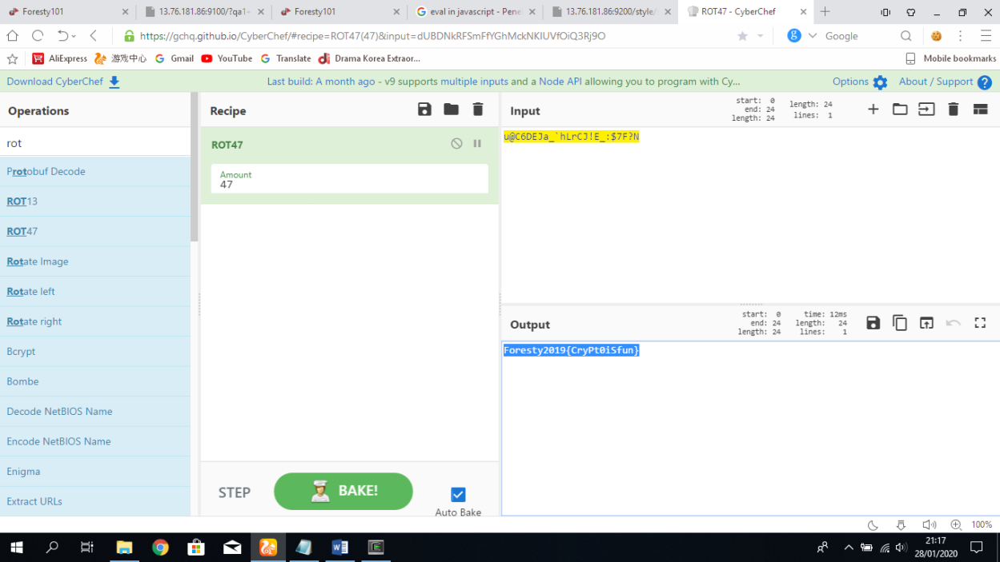

## Selamat datang crypto (50 pts)

Kita langsung disuguhkan dengan sebuah cipher text ```u@C6DEJa_`hLrCJ!E_:$7F?N```

Terdapat hint seperti berikut
> https://www.reddit.com/r/MRcryptography/comments/642mav/ciphers/

Langsung saja kita buka [CyberChef](https://gchq.github.io/CyberChef/) dan coba satu satu semua decoder nya dan ternyata `ROT47`



Bisa juga buka [dcode.fr](https://www.dcode.fr/rot-cipher) dan bruteforce semua enkripsi nya