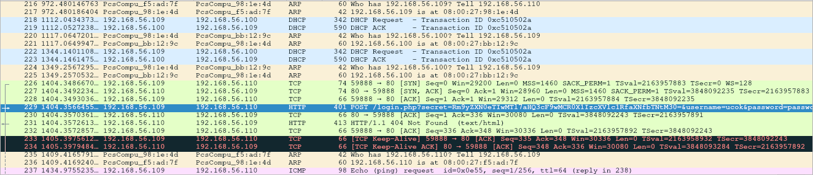

## Mamang post (50 pts)

Pada challenge ini kita mendapatkan sebuah file `inisoal.pcapng`

> pcapng merupakan sebuah file yang berisi `network capture` jadi bisa kita buka dengan menggunakan **wireshark**

Dilihat dari title challenge nya mungkin ada hubungan dengan post request(?), setelah dilihat lihat pada wireshark ternyata ada *packet* yang menarik 



Sebuah post request pada login.php dengan `secret=Rm9yZXN0eTIwMTl7aHQ3cF9wMCR0X1IzcXVlc1RfaXNfbTNtM30`

Kita tahu bahwa itu adalah **base64** encrypted text jadi langsung saja kita decrypt dan dapatkan flag nya

```bash
echo Rm9yZXN0eTIwMTl7aHQ3cF9wMCR0X1IzcXVlc1RfaXNfbTNtM30 | base64 -d > flag.txt
```