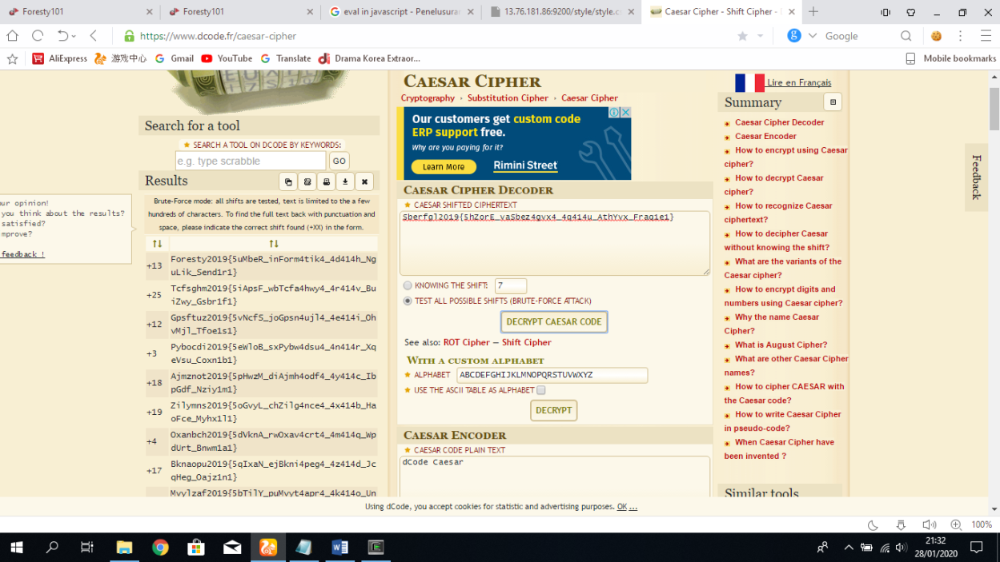

## Sisipin 13x (70 pts)

Kita dapatkan sebuah file `sisipin-13x.zip` pada challenge ini

Unzip file nya dan kita dapatkan sebuah image seperti berikut


Pasti ada sesuatu hal pada gambar itu, kita coba gunakan command `strings`

```bash
$ strings flag.jpg
JFIF
 , #&')*)
-0-(0%()(
((((((((((((((((((((((((((((((((((((((((((((((((((
$3br
%&'()*456789:CDEFGHIJSTUVWXYZcdefghijstuvwxyz
        #3R
&'()*56789:CDEFGHIJSTUVWXYZcdefghijstuvwxyz
"~s@
XKGe
r1Sa
4`K4
tlM0$
=I5C
e#VIE
^,Hw
h`bI
@9M@
lt+{u
oV0@aY
C!r)
(TEXT TIDAK PENTING……………)
27?/
9W=*
L\P!O
5Hhc
U $Q
Rar!
flag.txt
Sberfgl2019{5hZorE_vaSbez4gvx4_4q414u_AthYvx_Fraq1e1}
```

Bisa kita lihat diakhir `strings` ada flag tetapi hanya huruf nya saja yang aneh (2019 tetap pada posisi dan  penempatan yang benar)

Maka kita langsung saja coba **ROT Bruteforce** menggunakan [dcode.fr](https://www.dcode.fr/rot-cipher) dan dapatkan flag nya

