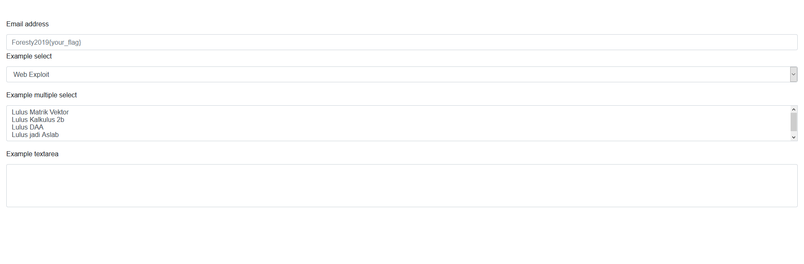
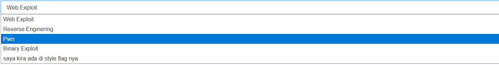
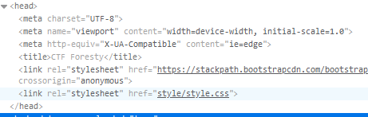
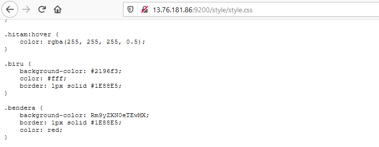
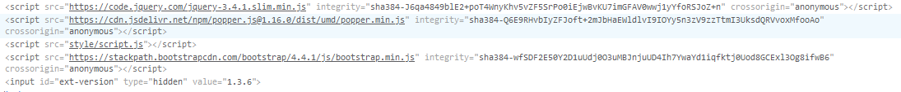
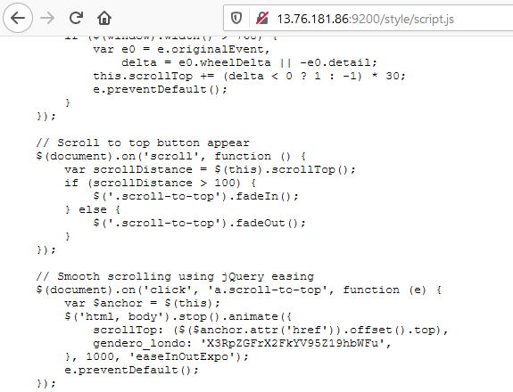

## Ngoding web skuy (50 pts)

Kita buka challege nya dan kita akan langsung dihadapi dengan sebuah website seperti berikut



Setelah itu kita langsung cari cari hal yang sekiranya akan menarik perhatian (*mencurigakan*)

Dan setelah dilihat lihat kita akan mendapatkan hal berikut



Dia mengatakan flag nya ada di style maka kita langsung saja lihat pada style nya dengan inspect element



Ternyata style nya berada pada ```/style/style.css```

Maka kita langsung saja masuk pada link itu dan kita cari kembali hal yang *interesting*



Digambar terlihat ada sebuah text yang kita sudah pasti biasa melihat dan bisa langsung *recognize* bahwa itu adalah **base64** encrypted text maka kita langsung saja decrypt

```bash
echo 'Rm9yZXN0eTEwMX' | base64 -d > flag.txt
```

Bisa kita lihat pada `flag.txt` dan mungkin flag nya belum selesai(?) maka dari itu kita kembali melihat pada source di inspect element, dan kita akan dapatkan hal menarik seperti berikut



Terlihat ada source file lainnya yaitu `/style/script.js`



Setelah kita buka dan lihat maka kita akan menemukan **base64** encrypted text lainnya, lakukan hal yang sama dan kita dapatkan seluruh flag nya

```bash
echo 'X3RpZGFrX2FkYV95Z19hbWFu' | base64 -d > flag.txt
```

> Masukkan flag nya dengan wrapper **Foresty2019{}**