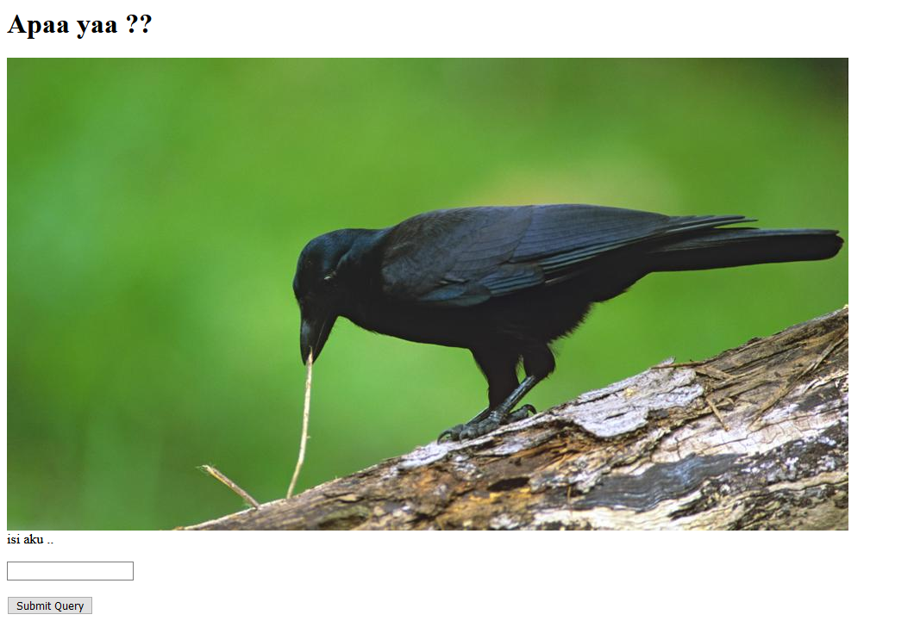
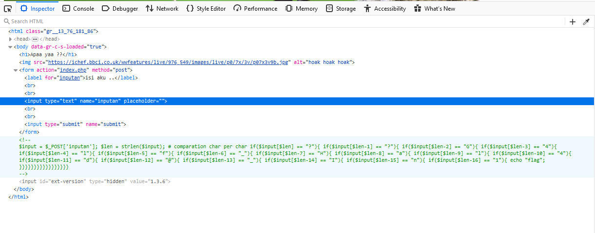

## Request me (80 pts)

Di challenge ini kita akan dihadapi pada sebuah website

Kita lihat ada sebuah kolom yang bisa kita inputkan sesuatu dan tombol untuk mensubmit query, karena kita tidak tahu apa yang harus dimasukkan kita langsung saja lihat pada source di inspect element

Terlihat sesuatu hal yang *menarik* maka dari itu kita copy semua text yang commented dan disitu terlihat seperti sebuah pengecekan pada **post request** dan mengecek suatu value dari `inputan` serta mengecek setiap karakter nya dan jika benar dia akan `echo "flag"` langsung saja gunakan text editor favorite kalian dan ambil setiap karakter nya, satukan dan didapatkan flagnya