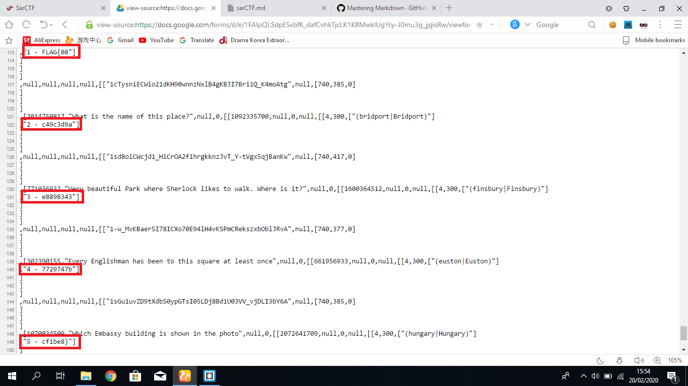

# SAR CTF 2020 Writeup By (mendung)10^6
## Author : Wrth

### True Detective
> 1681 points  
> And now it's time to show the skills of a real detective!  
> https://clck.ru/MCop6  

In this challenge we have to use our "detective skills" to find all the places in the picture, however I discovered a trick after the CTF ends that we can actually see the warning in the website source.

Type `view source:` in front of the google forms website and we scroll down to the very bottom and we can find the flag  

  

Flag : `FLAG{08c49c3d9ae88983437729747bcf1be8}` 

---

### Invitation
> 873 points
> Sherlock doesn't like going to parties. But this time an invitation came to him, which he could not refuse.
> [task_3e55f673c10d.pdf](https://sarctf.tk/files/d5178d11789ae7616b4c3d462b8b9a27/task_3e55f673c10d.pdf?token=eyJ1c2VyX2lkIjo1MDAsInRlYW1faWQiOjMxOCwiZmlsZV9pZCI6MTB9.Xk49Ow.6s57deWU5ZOvmTCxcS3AS_yR7ME)

In this challenge we are given a ciphertext with bunch of stick figures, I read some book of Sherlock Holmes and I know this is a [dancing men cipher](https://www.dcode.fr/dancing-men-cipher). However decoding each symbol by hand is quite inefficient, my friend propose to find the word `flag` first and starts decode around it, here is what we got:  

`this master huntsman flag disco in Saratov that the adventure was most grave one while the sardonic smile which occa`  

we think that it just put the word flag randomly because I can't really see some "flag words" in it, so we decided to decode the whole ciphertext. a pdf file store a XObject instead of a normal image file, therefore we can see all the XObject identity of each character and convert it into a plaintext  

  

The `R/Im` correspond to the position of character and 4 digit code after it is the identity  
Here's the python script to sort it and assign single letter to each character  

```python
text = []
for i in range(1000):
    text.append("xxxx")
text[0]=1151
text[1]=1143
text[10]=1145
text[100]=1147
text[101]=1149
text[102]=1151
text[103]=1153
text[104]=1153
text[105]=1155
text[106]=1157
text[107]=1159
text[108]=1145
text[109]=1161
text[11]=1153
text[110]=1163
text[111]=1165
text[112]=1143
text[113]=1167
text[114]=1149
text[115]=1163
text[116]=1151
text[117]=1165
text[118]=1169
text[119]=1171
text[12]=1151
text[120]=1147
text[121]=1163
text[122]=1159
text[123]=1149
text[124]=1143
text[125]=1147
text[126]=1155
text[127]=1153
text[128]=1169
text[129]=1163
text[13]=1175
text[130]=1177
text[131]=1179
text[132]=1159
text[133]=1177
text[134]=1181
text[135]=1155
text[136]=1153
text[137]=1145
text[138]=1159
text[139]=1165
text[14]=1163
text[140]=1145
text[141]=1177
text[142]=1143
text[143]=1163
text[144]=1149
text[145]=1165
text[146]=1159
text[147]=1165
text[148]=1145
text[149]=1177
text[15]=1155
text[150]=1151
text[151]=1153
text[152]=1163
text[153]=1165
text[154]=1143
text[155]=1183
text[156]=1177
text[157]=1143
text[158]=1147
text[159]=1163
text[16]=1153
text[160]=1185
text[161]=1153
text[162]=1163
text[163]=1159
text[164]=1169
text[165]=1155
text[166]=1157
text[167]=1143
text[168]=1147
text[169]=1163
text[17]=1145
text[170]=1177
text[171]=1143
text[172]=1149
text[173]=1163
text[174]=1163
text[175]=1143
text[176]=1153
text[177]=1159
text[178]=1169
text[179]=1187
text[18]=1143
text[180]=1177
text[181]=1157
text[182]=1153
text[183]=1159
text[184]=1177
text[185]=1147
text[186]=1163
text[187]=1145
text[188]=1167
text[189]=1187
text[19]=1151
text[190]=1155
text[191]=1165
text[192]=1147
text[193]=1151
text[194]=1177
text[195]=1159
text[196]=1167
text[197]=1177
text[198]=1143
text[199]=1163
text[2]=1179
text[20]=1169
text[200]=1149
text[201]=1163
text[202]=1157
text[203]=1163
text[204]=1159
text[205]=1143
text[206]=1167
text[207]=1149
text[208]=1163
text[209]=1177
text[21]=1163
text[210]=1151
text[211]=1177
text[212]=1159
text[213]=1179
text[214]=1143
text[215]=1147
text[216]=1159
text[217]=1143
text[218]=1147
text[219]=1151
text[22]=1177
text[220]=1177
text[221]=1189
text[222]=1149
text[223]=1155
text[224]=1179
text[225]=1177
text[226]=1179
text[227]=1163
text[228]=1149
text[229]=1163
text[23]=1179
text[230]=1145
text[231]=1149
text[232]=1159
text[233]=1179
text[234]=1165
text[235]=1145
text[236]=1155
text[237]=1179
text[238]=1165
text[239]=1151
text[24]=1147
text[240]=1165
text[241]=1143
text[242]=1147
text[243]=1155
text[244]=1167
text[245]=1185
text[246]=1147
text[247]=1143
text[248]=1159
text[249]=1165
text[25]=1163
text[250]=1145
text[251]=1147
text[252]=1151
text[253]=1177
text[254]=1143
text[255]=1147
text[256]=1151
text[257]=1165
text[258]=1153
text[259]=1151
text[26]=1165
text[260]=1187
text[261]=1177
text[262]=1181
text[263]=1155
text[264]=1169
text[265]=1187
text[266]=1149
text[267]=1163
text[268]=1177
text[269]=1177
text[27]=1159
text[270]=1163
text[271]=1145
text[272]=1151
text[273]=1175
text[274]=1165
text[275]=1163
text[276]=1179
text[277]=1165
text[278]=1155
text[279]=1143
text[28]=1143
text[280]=1179
text[281]=1147
text[282]=1159
text[283]=1143
text[284]=1179
text[285]=1151
text[286]=1153
text[287]=1145
text[288]=1189
text[289]=1163
text[29]=1143
text[290]=1159
text[291]=1177
text[292]=1143
text[293]=1179
text[294]=1163
text[295]=1179
text[296]=1163
text[297]=1149
text[298]=1163
text[299]=1159
text[3]=1159
text[30]=1147
text[300]=1189
text[301]=1155
text[302]=1167
text[303]=1143
text[304]=1143
text[305]=1155
text[306]=1147
text[307]=1167
text[308]=1165
text[309]=1143
text[31]=1159
text[310]=1145
text[311]=1155
text[312]=1179
text[313]=1165
text[314]=1151
text[315]=1165
text[316]=1143
text[317]=1147
text[318]=1163
text[319]=1145
text[32]=1143
text[320]=1159
text[321]=1149
text[322]=1175
text[323]=1191
text[324]=1167
text[325]=1165
text[326]=1185
text[327]=1153
text[328]=1163
text[329]=1155
text[33]=1147
text[330]=1157
text[331]=1181
text[332]=1149
text[333]=1151
text[334]=1169
text[335]=1151
text[336]=1165
text[337]=1159
text[338]=1153
text[339]=1153
text[34]=1155
text[340]=1155
text[341]=1165
text[342]=1145
text[343]=1155
text[344]=1165
text[345]=1189
text[346]=1167
text[347]=1143
text[348]=1151
text[349]=1179
text[35]=1167
text[350]=1159
text[351]=1177
text[352]=1179
text[353]=1163
text[354]=1153
text[355]=1153
text[356]=1159
text[357]=1177
text[358]=1177
text[359]=1167
text[36]=1149
text[360]=1149
text[361]=1163
text[362]=1145
text[363]=1157
text[364]=1149
text[365]=1155
text[366]=1169
text[367]=1143
text[368]=1147
text[369]=1163
text[37]=1151
text[370]=1189
text[371]=1163
text[372]=1159
text[373]=1149
text[374]=1151
text[375]=1165
text[376]=1185
text[377]=1155
text[378]=1157
text[379]=1143
text[38]=1157
text[380]=1147
text[381]=1151
text[382]=1177
text[383]=1169
text[384]=1159
text[385]=1177
text[386]=1143
text[387]=1163
text[388]=1149
text[389]=1147
text[39]=1155
text[390]=1167
text[391]=1165
text[392]=1143
text[393]=1177
text[394]=1169
text[395]=1159
text[396]=1165
text[397]=1157
text[398]=1153
text[399]=1159
text[4]=1177
text[40]=1167
text[400]=1185
text[401]=1145
text[402]=1151
text[403]=1177
text[404]=1181
text[405]=1155
text[406]=1151
text[407]=1165
text[408]=1195
text[409]=1159
text[41]=1165
text[410]=1149
text[411]=1159
text[412]=1143
text[413]=1155
text[414]=1161
text[415]=1143
text[416]=1147
text[417]=1159
text[418]=1143
text[419]=1143
text[42]=1145
text[420]=1147
text[421]=1163
text[422]=1159
text[423]=1145
text[424]=1161
text[425]=1163
text[426]=1165
text[427]=1143
text[428]=1167
text[429]=1149
text[43]=1169
text[430]=1163
text[431]=1179
text[432]=1159
text[433]=1177
text[434]=1159
text[435]=1169
text[436]=1155
text[437]=1177
text[438]=1143
text[439]=1185
text[44]=1171
text[440]=1149
text[441]=1159
text[442]=1161
text[443]=1163
text[444]=1155
text[445]=1165
text[446]=1163
text[447]=1179
text[448]=1147
text[449]=1151
text[45]=1177
text[450]=1153
text[451]=1163
text[452]=1143
text[453]=1147
text[454]=1163
text[455]=1177
text[456]=1159
text[457]=1149
text[458]=1145
text[459]=1155
text[46]=1163
text[460]=1165
text[461]=1151
text[462]=1181
text[463]=1177
text[464]=1169
text[465]=1151
text[466]=1153
text[467]=1163
text[468]=1179
text[469]=1147
text[47]=1153
text[470]=1151
text[471]=1181
text[472]=1147
text[473]=1155
text[474]=1181
text[475]=1181
text[476]=1159
text[477]=1177
text[478]=1151
text[479]=1155
text[48]=1157
text[480]=1165
text[481]=1159
text[482]=1153
text[483]=1153
text[484]=1171
text[485]=1189
text[486]=1149
text[487]=1155
text[488]=1175
text[489]=1163
text[49]=1177
text[490]=1143
text[491]=1147
text[492]=1149
text[493]=1155
text[494]=1167
text[495]=1185
text[496]=1147
text[497]=1147
text[498]=1151
text[499]=1177
text[5]=1151
text[50]=1163
text[500]=1159
text[501]=1177
text[502]=1181
text[503]=1163
text[504]=1143
text[505]=1151
text[506]=1181
text[507]=1185
text[508]=1153
text[509]=1155
text[51]=1159
text[510]=1155
text[511]=1169
text[512]=1189
text[513]=1155
text[514]=1145
text[515]=1163
text[516]=1145
text[517]=1153
text[518]=1151
text[519]=1143
text[52]=1143
text[520]=1143
text[521]=1153
text[522]=1163
text[523]=1185
text[524]=1155
text[525]=1155
text[526]=1145
text[527]=1157
text[528]=1155
text[529]=1149
text[53]=1163
text[530]=1143
text[531]=1147
text[532]=1163
text[533]=1155
text[534]=1189
text[535]=1191
text[536]=1163
text[537]=1181
text[538]=1143
text[539]=1155
text[54]=1145
text[540]=1157
text[541]=1155
text[542]=1167
text[543]=1149
text[544]=1197
text[545]=1167
text[546]=1163
text[547]=1177
text[548]=1143
text[55]=1189
text[56]=1163
text[57]=1177
text[58]=1151
text[59]=1145
text[6]=1165
text[60]=1163
text[61]=1147
text[62]=1151
text[63]=1169
text[64]=1151
text[65]=1165
text[66]=1159
text[67]=1147
text[68]=1159
text[69]=1165
text[7]=1145
text[70]=1177
text[71]=1155
text[72]=1169
text[73]=1169
text[74]=1171
text[75]=1149
text[76]=1163
text[77]=1161
text[78]=1155
text[79]=1153
text[8]=1163
text[80]=1161
text[81]=1163
text[82]=1149
text[83]=1151
text[84]=1165
text[85]=1169
text[86]=1171
text[87]=1187
text[88]=1155
text[89]=1181
text[9]=1163
text[90]=1175
text[91]=1163
text[92]=1143
text[93]=1159
text[94]=1165
text[95]=1145
text[96]=1143
text[97]=1147
text[98]=1163
text[99]=1143

charnow = "a"
x = {}
y = []
for i in text:
    if i == "xxxx":
        break
    try:
        y.append(x[str(i)])
        print x
    except KeyError:
        x[str(i)] = charnow
        y.append(x[str(i)])
        charnow = chr(ord(charnow)+1)

print "".join(y)
print x["1159"]
```

output :  
`abcdeafghhgiajhkigbalhecmhfdbbmdbmknoapknfglqehipehdbhgrheaghmalafdmdfekllqohskishoaflqtkujhbdfgbmhbmoaiikpdgshfbnohaflqmhdobmkilhecdeukigdfgebhofdfgeaihfbvebmhwihdlkpbmhebohhbidltepidemhgntkfmaednebhohphdbnoheaedcbmdbmaerokcechohgodcfgkcfafbmknwmbdfgmaebmafiateukltoheehgajfhcfkbcmdbcaigrhdebchchohdrknbbkmnfbgkcfafbmhgdojxnfwihkpuoalafdiikfgkfrnbacdechiideenohgpoklbmhrhdoafwkpbmaeldebhomnfbeldfpidwgaeukafydodbksbmdbbmhdgshfbnohcdedlkebwodshkfhcmaihbmhedogkfauelaihcmaumkuudeakfdiiqrokjhbmoknwmmaedeuhbauwikklrkghgiabbihwkkgpkobmhkrxhubkpknoznheb`  

notice there are some symbols, which means there are more than 26 letters there, there are a few uppercase letter which we have to manually fix it and just put it in [quipqiup](https://quipqiup.com/) to get the plaintext  

```txt biasa caranya gimana sih supaya ngga cuma garis lurus wkwkwk
it was indeed like old times when, at that hour, i found myself seated beside him in a hansom, my revolver in my pocket and the thrill of adventure in my heart. holmes was cold and stern and silent. as the gleam of the street-lamps flashed upon his austere features i saw that his brows were drawn down in thought and his thin lips compressed. i knew not what wild beast we were about to hunt down in the dark jungle of criminal london, but i was well assured from the bearing of this master huntsman flag disco in saratov that the adventure was a most grave one, while the sardonic smile which occasionally broke through his ascetic gloom boded little good for the object of our quest
```  

it was a pharagraph from [one of the Sherlock Holmes book](https://etc.usf.edu/lit2go/178/the-return-of-sherlock-holmes/3226/chapter-i-the-adventure-of-the-empty-house/) we can see that the word that isn't in the original one is `flag disco in saratov`, and thats the flag!

Flag : `FLAG{disco_in_saratov}` 

---

### Mind palace I  
> 802  points
> It looks like the situation is hopeless, there is no time to think. However, you can use the mind palace and solve all problems instantly.  
>  
> nc 212.47.229.1 33001  

it's a morse code, just decrypt it and get the flag, here's the python script I wrote:
```python
from pwn import *

#The decryption part of this code is from geeksforgeeks
MORSE_CODE_DICT = { 'A':'.-', 'B':'-...', 
                    'C':'-.-.', 'D':'-..', 'E':'.', 
                    'F':'..-.', 'G':'--.', 'H':'....', 
                    'I':'..', 'J':'.---', 'K':'-.-', 
                    'L':'.-..', 'M':'--', 'N':'-.', 
                    'O':'---', 'P':'.--.', 'Q':'--.-', 
                    'R':'.-.', 'S':'...', 'T':'-', 
                    'U':'..-', 'V':'...-', 'W':'.--', 
                    'X':'-..-', 'Y':'-.--', 'Z':'--..', 
                    '1':'.----', '2':'..---', '3':'...--', 
                    '4':'....-', '5':'.....', '6':'-....', 
                    '7':'--...', '8':'---..', '9':'----.', 
                    '0':'-----', ', ':'--..--', '.':'.-.-.-', 
                    '?':'..--..', '/':'-..-.', '-':'-....-', 
                    '(':'-.--.', ')':'-.--.-'} 

def decrypt(message): 
  
    # extra space added at the end to access the 
    # last morse code 
    message += '/'
  
    decipher = '' 
    citext = '' 
    for letter in message: 
  
        if (letter != '/'): 
 	    # storing '/'
            i = 0
  
            # storing morse code of a single character 
            citext += letter 
  
        else: 
            # if i = 1 that indicates a new character 
            i += 1
  
            # if i = 3 that indicates a new word 
            if i == 3 : 
  
                 # adding space to separate words 
                decipher += ' '
            else:
                try:
                    # accessing the keys using their values (reverse of encryption) 
                    decipher += list(MORSE_CODE_DICT.keys())[list(MORSE_CODE_DICT.values()).index(citext)] 
                    citext = '' 
                except ValueError:
                    continue

    return decipher 

r = remote("212.47.229.1",33001)
x = []
while True:
    y = r.recv()
    if "pip" in y:
        x.append(".")
    elif "piiiip" in y:
        x.append("-")
    elif "      " in y:
        x.append("/")

    if x[len(x)-1] == "/" and x[len(x)-2] == "/" and x[len(x)-3] == "/":
        print decrypt(x)
```  

output:  
`HERE UPON THE LAPEL OF MY COAT YOU MAY SEE THE RIBBON OF MY DECORATION BUT THE MEDAL ITSELF I KEEP IN A LEATHERN POUCH AT HOME FLAG SHERLOCK LIKES YOUR MORSE`

Flag : `FLAG{SHERLOCK_LIKES_YOUR_MORSE}`

---

### Mind palace II
> 890 points
> It's time to strain your brains.
>  
> nc 212.47.229.1 33002

It's rot13, just write a script to answer it automatically:

```python
from pwn import *

r = remote("212.47.229.1",33002)

while True:
	response = r.recv()
	print response
	if "FLAG" in response[0]:
		break
	response = response.split("  ")
	cipher = response[len(response)-1].split("\n")[0]
	text = cipher.decode("rot13")
	r.sendline(text)
	print "DONE"
```

Flag : `FLAG{Y0U_V3RY_F45T3R_CRYPT0GR4PH}`

---

### Mind palace III
> 896 points
> 100% of brain CPU
> 
> nc 212.47.229.1 33003

It's a bitwise operation, just write a script to answer it automatically:  

```python
from pwn import *

r = remote("212.47.229.1",33003)
response = r.recv()
#make this twice because there is a header at the beginning lol
operation = response.split("\n[>] ")[1].split(" ")
print response
result = 0
if operation[1] == "AND":
		result = int(operation[0]) & int(operation[2])
if operation[1] == "OR":
		result = int(operation[0]) | int(operation[2])
if operation[1] == "XOR":
		result = int(operation[0]) ^ int(operation[2])

r.sendline(str(result))
print "DONE"

while True:
	response = r.recv()
	operation = response.split("[>] ")[1].split(" ")
	print response
	if "FLAG" in response:
		break
	result = 0
	if operation[1] == "AND":
		result = int(operation[0]) & int(operation[2])
	if operation[1] == "OR":
		result = int(operation[0]) | int(operation[2])
	if operation[1] == "XOR":
		result = int(operation[0]) ^ int(operation[2])

	r.sendline(str(result))
	print "DONE"
```

Flag : `FLAG{0HH_Y0UR3_4_V3RY_5M3RT_M4TH3M4T1C}`

---

### Magic of numbers
> 902 points
> Do you think Sherlock can beat a computer in math?
> 
> nc 212.47.229.1 33004

this is just an addition, but the last question is `0.1 + 0.2`, which have some floating point error if you type it in python interpreter, so instead send `0.30000000000000004` and get the flag  

Flag : `FLAG{MaGiC_0f_NuMbErS}`