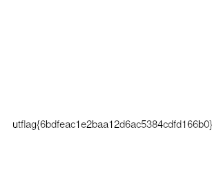
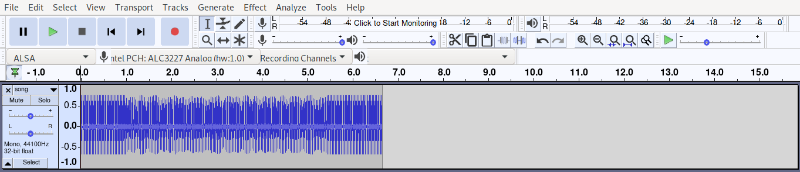
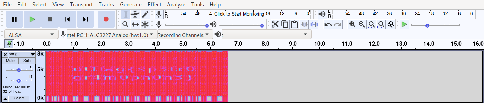
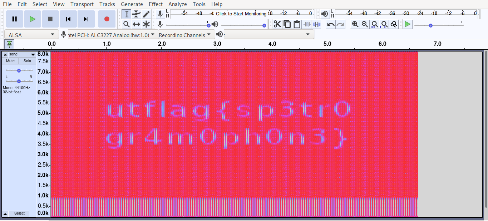
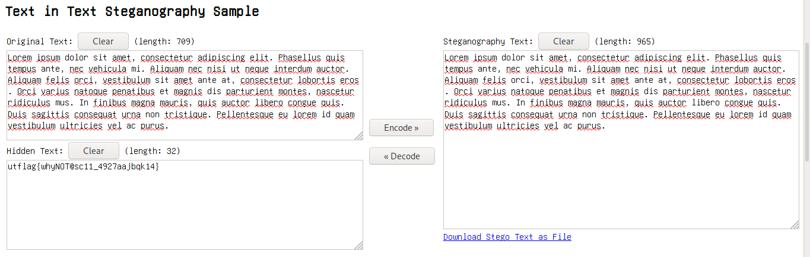
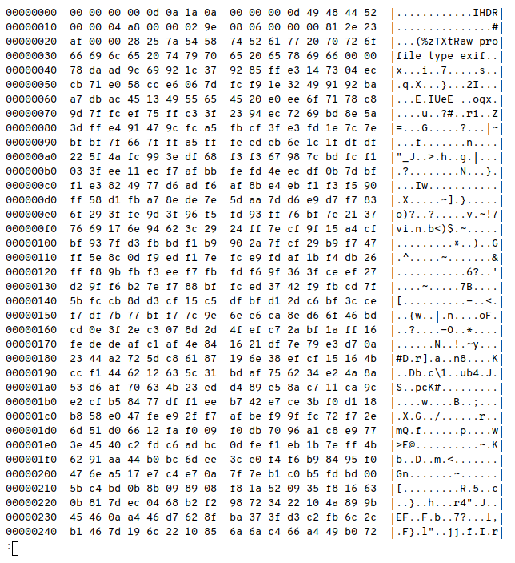
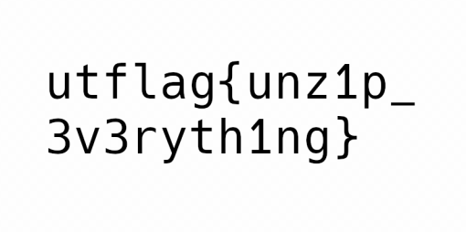

# utctf 2020 WriteUp by (mendung)10^6
## Author: f4r4w4y

### 1 frame per minute (50 pts)
**Category: Forensics**  
Challenge Description:
> I recently received this signal transmission known as SSTV in a mode called Martian? This technology is all very old so I'm not sure what to do with it. Could you help me out?

Challenge Link : https://github.com/utisss/UTCTF-20/tree/master/forensics-sstv

Just by reading the description of the challenge we could understand that its a typical forensic challenge that has something to do with sstv, and with the fact that were given a **wav** file, my first guess is that it is the sstv signal that we have to put into some sstv decoder

So i downloaded [MMSSTV](https://hamsoft.ca/pages/mmsstv.php) and open it with my windows pc, play the wav file and the decoder will start to draw the image, and we should get the image like below **(even though it might not as clear as this)**



flag = **utflag{6bdfeac1e2baa12d6ac5384cdfd166b0}**

---

### Basic (50 pts)
**Category: Forensics**  
Challenge Description:
> My friend said they hid a flag in this picture, but it's broken!

Challenge Link : https://github.com/utisss/UTCTF-20/tree/master/basics-forensics

We are initially given a jpeg file, but **remember** the very first thing to do when given a file in forensic type challenge is to check for the extension by using `file` command

```shell
[fai@f4r4w4y basic]$ file secret.jpeg
secret.jpeg: UTF-8 Unicode text, with CRLF line terminators
```

It turns out that its just a text file so maybe just grep for flag (?)

```shell
[fai@f4r4w4y basic]$ cat secret.jpeg | grep utflag
utflag{fil3_ext3nsi0ns_4r3nt_r34l}
```

and we get the flag

flag = **utflag{fil3_ext3nsi0ns_4r3nt_r34l}**

---

### Observe Closely (50 pts)
**Category: Forensics**  
Challenge Description:
> A simple image with a couple of twists...

Challenge Link : https://github.com/utisss/UTCTF-20/tree/master/forensics-file-carving

We are initially given a png file, firing a file command gives us `png` as the file extension

Try binwalk to extract some hidden files inside it **(if any)**

```shell
[fai@f4r4w4y observe-closely]$ binwalk -e Griffith_Observatory.png 

DECIMAL       HEXADECIMAL     DESCRIPTION
--------------------------------------------------------------------------------
0             0x0             PNG image, 320 x 155, 8-bit/color RGBA, non-interlaced
41            0x29            Zlib compressed data, default compression
127759        0x1F30F         Zip archive data, at least v2.0 to extract, compressed size: 2587, uncompressed size: 16664, name: hidden_binary
130500        0x1FDC4         End of Zip archive, footer length: 22
```

So there are some files inside, and there is an executable file named `hidden_binary`, running the file will give us the flag

```shell
[fai@f4r4w4y _Griffith_Observatory.png.extracted]$ ./hidden_binary 
Ah, you found me!
utflag{2fbe9adc2ad89c71da48cabe90a121c0}
```

flag = **utflag{2fbe9adc2ad89c71da48cabe90a121c0}**

---

### Spectre (50 pts)
**Category: Forensics**  
Challenge Description:
> I found this audio file, but I don't think it's any song I've ever heard... Maybe there's something else inside?

Challenge Link : https://github.com/utisss/UTCTF-20/blob/master/forensics-spectrogram

We are initially given a wav file, but there are no something to do with sstv so its an audio based forensic challenge, and with that lets open the wav file in [audacity](https://www.audacityteam.org/)

Here's how it looks like in audacity



Now lets see in spectrogram mode (as it is what always comes up in mind when solving this kind of challenge)



There seem to be a flag but not clear, so just resize the window untill we can see it clearly



flag = **utflag{sp3tr0gr4m0ph0n3}**

---

### Zero (50 pts)
**Category: Forensics**  

Challenge Link : https://github.com/utisss/UTCTF-20/blob/master/forensics-unicode-zero

We are only given a txt file, but the size of the file doesn't seem to match with the content inside of it

**Remember**  
The file inside challenge link is different with what i got because the organizers updated the file and somehow i become unable to decode it using this method below (so instead use the text below)

```text
​​​​​​​​Lorem ipsum​​​​​​​ dolor ‌‌‌‌‍‍‍sit​​​​​​​​ amet​​​​​​​​​‌‌‌‌‍‍‌, consectetur ​​​​​​​adipiscing​​​​​​​‌‌‌‌‍‬‍‬ elit​​​​​​​.‌‌‌‌‍‬‌​​​​​​​‌‌‌‌‍‬‌‍ Phasellus quis​​​​​​​ tempus​​​​​​ ante, ​​​​​​​​nec vehicula​​​​​​​​​​​​​​​​ mi​​​​​​​​. ​​​​​​​‌‌‌‌‍‬‍Aliquam nec​​​​​​​​​‌‌‌‌‍‬ nisi ut neque​​​​​​​ interdum auctor​​​​​​​.‌‌‌‌‍‍ Aliquam felis ‌‌‌‌‍‬‬‌orci​​​​​​​, vestibulum ‌‌‌‌‍‬‍sit ​​​​​​​amet​​​​​​​​​ ante‌‌‌‌‍‌‬ at​​​​​​​, consectetur‌‌‌‌‍‌ lobortis eros​​​​​​​​​.‌‌‌‌‍‍‍‌ ‌‌‌‌‍‌‌‌​​​​​​​Orci varius​​​​​​​ ​​​​​​​natoque ‌‌‌‌‍‌penatibus et ‌‌‌‌‍‬‌​​​​​​​magnis‌‌‌‌‌‌‍‌‌‌‌‌‌‍ dis ​​​​​​​‌‌‌‌‍‍parturient montes, ​​​​​​​nascetur ridiculus ‌‌‌‌‌‍‌​​​​​​​​​​​​​​‌‌‌‌‌‬‍mus. In finibus‌‌‌‌‌‌‬ magna​​​​​​‌‌‌‌‌‍ mauris, quis‌‌‌‌‍‬‌‍ auctor ‌‌‌‌‍‬‌‍libero congue quis. ‌‌‌‌‍‬‬‬Duis‌‌‌‌‍‬‌‬ sagittis consequat urna non tristique. Pellentesque eu lorem ‌‌‌‌‍‌‍id‌‌‌‌‍‬‬ quam vestibulum ultricies vel ac purus‌‌‌‌‌‌‍.‌‌‌‌‌‍‌‌‌‌‌‍‍
```

But when you copy paste it to some of text editor (i use vscode), there are some unprintable character and when trying to delete it i got to do some countable bakcspaces to be able to delete the character

After bit of researches online, there is this thing so called zero-width character, its some kind of encoding that set the char to have only zero width but indeed its still a char so it still have some value

I carve content inside of the text using [this](https://330k.github.io/misc_tools/unicode_steganography.html) website



flag = **utflag{whyNOT@sc11_4927aajbqk14}**

---

### Legend of Hackerman 1 (50 pts)
**Category: Forensics**  
Challenge Description:
> My friend Hackerman tried to send me a secret transmission, but I think some of it got messed up in transit. Can you fix it?

Challenge Link : https://github.com/utisss/UTCTF-20/tree/master/forensics-file-header

We are initially given a png file but when try to open it, its somehow broken

Using `file` command and we get this

```shell
[fai@f4r4w4y legend_hackerman1]$ file hackerman.png 
hackerman.png: data
```

I thought maybe the file is broken or something, so i checked with `hexdump -C hackerman.png | less`



Looking closely to the first couple of bytes it looks like png magic byte but some bytes are missing 

FILE | BYTES
---- | -----
PNG magic bytes | 89 50 4E 47 0D 0A 1A 0A
File first couple of bytes | 00 00 00 00 0D 0A 1A 0A

Just by fixing those bytes to png bytes will get the fixed image


flag = **utflag{3lit3_h4ck3r}**

---

### Legend of Hackerman 2 (50 pts)
**Category: Forensics**  
Challenge Description:
> Ok, I've received another file, but it's just a Word Document? Hackerman said that he attached a picture of the flag, but I can't find it...

Challenge Link : https://github.com/utisss/UTCTF-20/tree/master/forensics-docx

We are initially given a docx file, i straight to extract all the files inside using binwalk and got some of the files

Going inside `word/media` we got so many images, because the description says that there is picture of flag so just iterate through all the pictures and find one which is the flag **(image23.png)**



flag = **utflag{unz1p_3v3ryth1ng}**

---

### Basic [RE] (50 pts)
**Category: Reversing**  
Challenge Description:
> I know there's a string in this binary somewhere.... Now where did I leave it?

Challenge Link : https://github.com/utisss/UTCTF-20/blob/master/basics-re

This one is just basic string grep chall

```shell
[fai@f4r4w4y basic]$ strings calc | grep utflag
utflag{str1ngs_1s_y0ur_fr13nd}
```

flag = **utflag{str1ngs_1s_y0ur_fr13nd}**

---

### Basic [RE] (50 pts)
**Category: Reversing**  
Challenge Description:
> I know there's a string in this binary somewhere.... Now where did I leave it?

Challenge Link : https://github.com/utisss/UTCTF-20/blob/master/basics-re

This one is just basic string grep chall

```shell
[fai@f4r4w4y basic]$ strings calc | grep utflag
utflag{str1ngs_1s_y0ur_fr13nd}
```

flag = **utflag{str1ngs_1s_y0ur_fr13nd}**

---